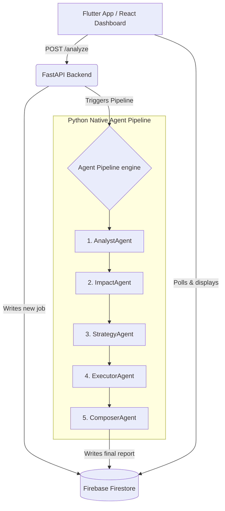

# Axion — Autonomous Content-to-Action Agent

**Google Hackathon 2026 — Challenge 1**

> Axion is a 5-agent AI pipeline that ingests unstructured news articles (text, URLs), analyzes their direct financial impact on the Pakistani business market (specifically logistics and pricing), generates ranked strategic actions, and simulates execution with real-time before/after state visualizations — **fully orchestrated natively in Python using Vertex AI**.

## 📋 Mandatory Submissions
1. **Mobile App Link**: [Insert Mobile App Drive Link Here]
2. **Github Repository**: [Insert Github Repository Link Here]
3. **Demo Video**: [Insert Demo Video Link Here] (3-5 minutes showcasing workflow, agency, and innovation)
4. **Antigravity Usage Video**: [Insert Antigravity Video Link Here] (2-3 minutes screen recording)
5. **README / Documentation**: (See below for architecture, APIs, agents, and integration details)
6. **Antigravity Trace / Logs**: [Download antigravity_traces.zip](antigravity_traces.zip)

*(Note: Optional submissions have been omitted as requested)*

---

## 🏛 Architecture Overview



### Data Flow

1. **Input Layer:** Flutter app or React dashboard submits a news article (raw text or URL) via REST API.
2. **Trigger Layer:** FastAPI backend extracts text and writes it to Firestore `pending_analysis` collection.
3. **Intelligence Layer:** The backend immediately triggers the Python-native agent pipeline (`agent_pipeline.py`), which orchestrates 5 sequential agents using Google Vertex AI (`gemini-2.5-flash`).
4. **Output Layer:** Frontends poll Firestore for `pipeline_status` and render the `final_report` document — including before/after pricing tables, notification drafts, and stakeholder alerts.

---

## 🛠 Technology Stack

| Component | Technology | Purpose |
|---|---|---|
| **Orchestrator** | Python Backend Pipeline | Manages agent reasoning, workflows, and sequential execution |
| **Backend API** | FastAPI (Python 3.11) | Triggers the pipeline, interacts with Firebase, and serves endpoints |
| **Database / State Bus** | Firebase Firestore | Shared state between agents and frontends (9 collections) |
| **Web Dashboard** | React 19 + Vite | Real-time results visualization with polling |
| **Mobile App** | Flutter 3.x (Dart) | Article submission and impact report viewing |
| **URL Scraping** | BeautifulSoup4 + httpx | Fetches and parses article text from URLs |
| **LLMs** | Gemini 2.5 Flash via Vertex AI | Multi-agent reasoning, data extraction, and simulation logic |

---

## 🧠 Agents Developed

### Agent 1 — AnalystAgent
- **Purpose:** Precision news extraction engine — extracts verifiable facts, economic signals, key entities, and source credibility scores.
- **Output:** Structured JSON with headline, topic classification, economic signals (magnitude + direction), and credibility score.

### Agent 2 — ImpactAgent
- **Purpose:** Pakistan business impact calculator — uses fixed business parameters (mid-size logistics company in Lahore, 200 orders/day, Rs.3,500 AOV) to quantify real PKR impact.
- **Output:** Delivery cost changes, margin compression, monthly revenue impact, severity rating with thresholds.

### Agent 3 — StrategyAgent
- **Purpose:** Senior Pakistan business strategy advisor — generates exactly 3 ranked, executable actions specific to Pakistani market.
- **Output:** Ranked actions with rationale, steps, expected outcome, effort/impact/timeframe ratings. Only Rank 1 is flagged for simulation.

### Agent 4 — ExecutorAgent
- **Purpose:** Simulation engine — executes 3 parallel sub-simulations for the Rank 1 action:
  1. **Pricing Update:** Recalculates all product prices in `pricing_table` to maintain 18% margin, rounds to nearest Rs.5.
  2. **Notification Draft:** Generates professional email + SMS (with Urdu transliteration) for customer communication.
  3. **Workflow Alert:** Creates P1/P2/P3 stakeholder alert with escalation paths and team-specific deadlines.

### Agent 5 — ComposerAgent
- **Purpose:** Output assembler — reads ALL agent outputs, simulation states, notifications, and alerts to produce the unified `final_report` document with formatted PKR amounts.

---

## 🔌 Integrations Implemented

### Firestore Collections (9 total)
| Collection | Purpose |
|---|---|
| `pending_analysis` | Input articles from frontends |
| `agent_outputs` | Agent results (`agent1_result` through `agent4_result`) |
| `pricing_table` | Product pricing — mutated by ExecutorAgent |
| `simulation_state` | Before/after pricing snapshots |
| `notification_drafts` | Email + SMS output from ExecutorAgent |
| `workflow_alerts` | Stakeholder alert output |
| `execution_log` | Timestamped log entries from all agents |
| `final_report` | Assembled output read by frontends |
| `pipeline_status` | Completion signal polled by frontends |

---

## 📊 Action Simulation (Critical Requirement)

Axion simulates execution for the Rank 1 recommended action using the ExecutorAgent:

1. **Mock Database Update:** Updates `pricing_table` collection in Firestore with recalculated product prices based on quantified impact metrics.
2. **Notification System:** Drafts targeted email and SMS notifications (including Urdu transliteration) for customers.
3. **Workflow Trigger:** Generates a priority-based stakeholder alert for the operations team with escalation paths.
4. **Outcome Visualization:** Flutter and React apps display Before/After state of the pricing table alongside execution logs.

> **Mock vs Real APIs:** All APIs in this prototype are mock/simulated. The pricing table uses hardcoded seed data representing a mid-size Pakistani logistics company. Notification drafts are generated but not sent. Stakeholder alerts are written to Firestore but not dispatched to external systems. The news extraction and impact calculation use real LLM reasoning via Vertex AI.

---

## 🚀 Running the Project

### Prerequisites
- Python 3.11+ with `pip`
- Node.js 18+ with `npm`
- Flutter SDK 3.x
- Firebase project with Firestore enabled
- Google Cloud Project with Vertex AI enabled

### 1. Environment Setup
```bash
cp .env.example .env
# Fill in ALL keys in .env
```

### 2. Backend API
```bash
cd backend
pip install -r requirements.txt
uvicorn main:app --reload --port 8000
# Seed demo data: curl -X POST http://localhost:8000/seed
```
*Note: The backend has been deployed to Google Cloud Run at `https://axion-backend-133838314315.us-central1.run.app`.*

### 3. Frontends

**React Dashboard:**
```bash
cd dashboard
npm install
npm run dev
```

**Flutter Mobile App:**
```bash
cd flutter_app
flutter pub get
flutter run
```

---

## 📁 Project Structure

```
Axion/
├── backend/                    # FastAPI app and Native Agent Pipeline
│   ├── main.py                 # API endpoints
│   └── services/
│       ├── firebase_client.py  # Firestore read/write helpers
│       ├── agent_pipeline.py   # Full 5-agent pipeline using Vertex AI
│       └── news_ingester.py    # URL scraping (BeautifulSoup + httpx)
├── dashboard/                  # React + Vite web dashboard
│   └── src/
│       ├── components/         # UI components
│       └── pages/              # AnalyzePage, ResultsPage, HistoryPage
├── flutter_app/                # Flutter mobile app
│   └── lib/
│       ├── main.dart
│       ├── api_service.dart
│       └── screens/            # InputScreen, ProcessingScreen, ResultScreen
├── firebase/
│   ├── firestore.rules         # Security rules
│   └── firestore.indexes.json  # Composite indexes
├── scripts/
│   ├── demo.bat                # One-click demo launcher
│   └── export_agent_trace.py   # Exports Firestore execution logs for submission
├── .env.example                # Environment variables template
└── README.md                   # This file
```
