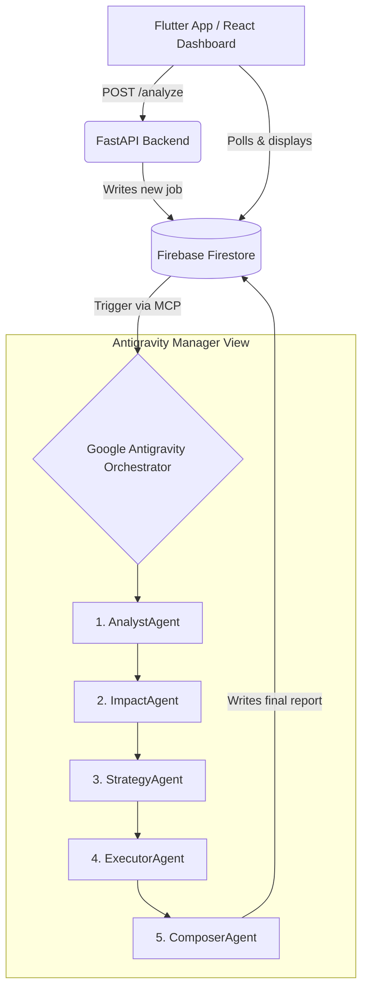

# Axion — Autonomous Content-to-Action Agent (Google Antigravity Challenge 1)

**Axion** is a 5-agent AI pipeline that ingests unstructured news articles (text, URLs, PDFs), analyzes their direct financial impact on the Pakistani business market (specifically logistics and pricing), generates ranked strategic actions, and simulates execution with real-time before/after state visualizations — **fully orchestrated by Google Antigravity**.

## 🎥 Demo Video
*(Link to 3-5 minute demo video goes here)*

## 🏛 Architecture Overview



## 🛠 Tools & APIs Used

| Component | Technology | Purpose |
|---|---|---|
| **Orchestrator** | Google Antigravity | Manages agent reasoning, workflows, and tool execution (Manager View) |
| **Agent Logic** | `.agents/*.md` | Declarative instructions and schemas for each agent |
| **Backend API** | FastAPI (Python) | Thin trigger layer, PDF extraction (PyMuPDF), URL scraping |
| **Database/State** | Firebase Firestore | Shared state bus for agents and frontends |
| **MCP Server** | Node.js Express | `firebase-mcp` providing read/write/listen tools to Antigravity |
| **Web App** | React + Tailwind | Web dashboard to view results |
| **Mobile App (MUST)**| Flutter | Mobile app to submit documents and view impact reports |
| **LLMs** | Claude 3.5 Sonnet, Haiku, Gemini 1.5 Flash | Diverse models assigned per task via pipeline config |

## 🧠 How Antigravity is Used (Core Orchestration)

Antigravity is the absolute center of the Axion system. The backend makes **zero** LLM calls. 

1. **Triggering:** The backend simply writes a `pending_analysis` document to Firestore.
2. **MCP Integration:** Antigravity connects to our custom `firebase-mcp` server, granting agents the ability to read and write to Firestore.
3. **Manager View Workspaces:** We use Antigravity's Manager View to sequence the agents:
   - **Workspace A:** `01_analyst_agent.md` (extracts facts) → triggers `02_impact_agent.md` (calculates PKR impact).
   - **Workspace B:** `03_strategy_agent.md` (generates 3 ranked actions based on Workspace A).
   - **Workspace C:** `04_executor_agent.md` (simulates pricing changes) → triggers `05_composer_agent.md` (assembles final JSON report).

## 📊 Action Simulation (Critical Requirement)

Axion simulates execution for the Rank 1 recommended action using the `ExecutorAgent`:
1. **Mock API/Database Update:** Updates the `pricing_table` collection in Firestore with newly calculated product prices.
2. **Notification System:** Drafts targeted email and SMS notifications (including Urdu transliteration) for customers.
3. **Workflow Trigger:** Generates a P1 stakeholder alert for the operations team.
4. **Outcome Visualization:** The Flutter and React apps display the Before/After state of the pricing table alongside the execution logs.

## 📋 Assumptions

- **Business Profile:** The system evaluates impact based on a hardcoded profile (Mid-size logistics company in Lahore, 200 orders/day, 18% current margin).
- **Data Freshness:** Agents rely on the provided news text. External verification is assumed to be handled by the user prior to submission.
- **Antigravity State:** The Antigravity Manager View must be actively open and monitoring the Firebase MCP for the pipeline to progress automatically.

## 🚀 Running the Project

### 1. Environment Setup
```bash
cp .env.example .env
# Fill in ALL keys in .env
```

### 2. Firebase MCP Server (Must run first)
```bash
cd firebase/mcp_server
npm install
node index.js
# Runs on port 3001
```

### 3. Backend API
```bash
cd backend
pip install -r requirements.txt
uvicorn main:app --reload --port 8000
# Seed demo data: curl -X POST http://localhost:8000/seed
```

### 4. Frontends
**React Dashboard:**
```bash
cd dashboard
npm install
npm run dev
```

**Flutter Mobile App:**
```bash
cd flutter_app
flutter pub get
flutter run
```

### 5. Start Antigravity Pipeline
1. Open Antigravity.
2. Verify `firebase-mcp` is connected.
3. Open Manager View.
4. Setup the 3 workspaces as defined in `.agents/pipeline_config.md`.
5. Submit an article via Flutter or React to watch the agents execute!

---
*Built for Google Antigravity Hackathon 2026*
