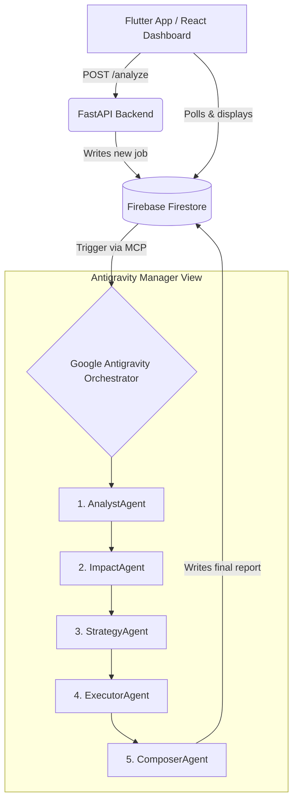

# Axion — Autonomous Content-to-Action Agent

**Google Antigravity Hackathon 2026 — Challenge 1**

> Axion is a 5-agent AI pipeline that ingests unstructured news articles (text, URLs, PDFs), analyzes their direct financial impact on the Pakistani business market (specifically logistics and pricing), generates ranked strategic actions, and simulates execution with real-time before/after state visualizations — **fully orchestrated by Google Antigravity**.

## 🎥 Demo Video
*(Link to 3–5 minute demo video)*

## 🎥 Antigravity Usage Video
*(Link to 2–3 minute screen recording of Antigravity usage)*

---

## 🏛 Architecture Overview



### Data Flow

1. **Input Layer:** Flutter app or React dashboard submits a news article (raw text, URL, or PDF) via REST API.
2. **Trigger Layer:** FastAPI backend extracts text (using BeautifulSoup for URLs, PyMuPDF for PDFs) and writes it to Firestore `pending_analysis` collection.
3. **Intelligence Layer:** Antigravity Manager View detects the new document and sequentially triggers 5 agents, each reading/writing to Firestore through a custom MCP server.
4. **Output Layer:** Both frontends poll Firestore for `pipeline_status` and render the `final_report` document — including before/after pricing tables, notification drafts, and stakeholder alerts.

**Key Design Decision:** The backend makes **zero** LLM calls. All intelligence resides in Antigravity agent definitions (`.agents/*.md`). The backend is a thin trigger layer only.

---

## 🛠 Technology Stack

| Component | Technology | Purpose |
|---|---|---|
| **Orchestrator** | Google Antigravity (Manager View) | Manages agent reasoning, workflows, and tool execution |
| **Agent Definitions** | `.agents/*.md` (6 files) | Declarative instructions, schemas, and trigger chains per agent |
| **Backend API** | FastAPI (Python 3.11) | Thin trigger layer — receives articles, writes to Firestore, serves status |
| **Database / State Bus** | Firebase Firestore | Shared state between agents and frontends (9 collections) |
| **MCP Server** | Node.js + Express + `@modelcontextprotocol/sdk` | Custom `firebase-mcp` server providing `firestore_read`, `firestore_write`, `firestore_batch_write`, `firestore_listen` tools to Antigravity |
| **Web Dashboard** | React 19 + Vite | Real-time results visualization with polling |
| **Mobile App** | Flutter 3.x (Dart) | Article submission and impact report viewing |
| **PDF Extraction** | PyMuPDF (fitz) | Extracts text from uploaded PDF documents |
| **URL Scraping** | BeautifulSoup4 + httpx | Fetches and parses article text from URLs |
| **LLMs** | Gemini Flash, Gemini Flash Lite, Claude Sonnet 4, Claude Haiku | Multi-model stack assigned per agent based on task complexity |

---

## 🧠 Agents Developed

### Agent 1 — AnalystAgent (`01_analyst_agent.md`)
- **Model:** Gemini 3.1 Flash Lite
- **Purpose:** Precision news extraction engine — extracts verifiable facts, economic signals, key entities, and source credibility scores.
- **Output:** Structured JSON with headline, topic classification, economic signals (magnitude + direction), and credibility score.

### Agent 2 — ImpactAgent (`02_impact_agent.md`)
- **Model:** Gemini 3 Flash
- **Purpose:** Pakistan business impact calculator — uses fixed business parameters (mid-size logistics company in Lahore, 200 orders/day, Rs.3,500 AOV) to quantify real PKR impact.
- **Output:** Delivery cost changes, margin compression, monthly revenue impact, severity rating with thresholds.

### Agent 3 — StrategyAgent (`03_strategy_agent.md`)
- **Model:** Claude Sonnet 4
- **Purpose:** Senior Pakistan business strategy advisor — generates exactly 3 ranked, executable actions specific to Pakistani market.
- **Output:** Ranked actions with rationale, steps, expected outcome, effort/impact/timeframe ratings. Only Rank 1 is flagged for simulation.

### Agent 4 — ExecutorAgent (`04_executor_agent.md`)
- **Model:** Gemini 3 Flash
- **Purpose:** Simulation engine — executes 3 parallel sub-simulations for the Rank 1 action:
  1. **Pricing Update:** Recalculates all product prices in `pricing_table` to maintain 18% margin, rounds to nearest Rs.5, flags >15% increases.
  2. **Notification Draft:** Generates professional email + SMS (with Urdu transliteration) for customer communication.
  3. **Workflow Alert:** Creates P1/P2/P3 stakeholder alert with escalation paths and team-specific deadlines.

### Agent 5 — ComposerAgent (`05_composer_agent.md`)
- **Model:** Claude Haiku 4.5
- **Purpose:** Output assembler — reads ALL agent outputs, simulation states, notifications, and alerts to produce the unified `final_report` document with formatted PKR amounts.

### Pipeline Configuration (`pipeline_config.md`)
- Documents model assignments, trigger chain, Firestore collections, and Manager View workspace layout.

---

## 🔌 Integrations Implemented

### MCP Server (`firebase/mcp_server/`)
Custom Model Context Protocol server enabling Antigravity agents to interact with Firestore:
- **`firestore_read`** — Read a single document by collection + document ID
- **`firestore_write`** — Write/merge data to a document
- **`firestore_batch_write`** — Atomic batch writes across multiple documents
- **`firestore_listen`** — Retrieve all documents in a collection (polling-based)

Connected via SSE transport on `localhost:3001`.

### Firestore Collections (9 total)
| Collection | Purpose |
|---|---|
| `pending_analysis` | Input articles from frontends |
| `agent_outputs` | Agent results (`agent1_result` through `agent4_result`) |
| `pricing_table` | Product pricing — mutated by ExecutorAgent |
| `simulation_state` | Before/after pricing snapshots |
| `notification_drafts` | Email + SMS output from ExecutorAgent |
| `workflow_alerts` | Stakeholder alert output |
| `execution_log` | Timestamped log entries from all agents |
| `final_report` | Assembled output read by frontends |
| `pipeline_status` | Completion signal polled by frontends |

---

## 📊 Action Simulation (Critical Requirement)

Axion simulates execution for the Rank 1 recommended action using the ExecutorAgent:

1. **Mock Database Update:** Updates `pricing_table` collection in Firestore with recalculated product prices based on quantified impact metrics.
2. **Notification System:** Drafts targeted email and SMS notifications (including Urdu transliteration) for customers.
3. **Workflow Trigger:** Generates a priority-based stakeholder alert for the operations team with escalation paths.
4. **Outcome Visualization:** Flutter and React apps display Before/After state of the pricing table alongside execution logs.

> **Mock vs Real APIs:** All APIs in this prototype are mock/simulated. The pricing table uses hardcoded seed data representing a mid-size Pakistani logistics company. Notification drafts are generated but not sent. Stakeholder alerts are written to Firestore but not dispatched to external systems. The news extraction and impact calculation use real LLM reasoning via Antigravity agents.

---

## 📋 Assumptions

- **Business Profile:** Evaluates impact for a hardcoded profile (mid-size logistics company in Lahore, 200 orders/day, 18% current margin, Rs.21M monthly revenue).
- **Data Freshness:** Agents rely on provided news text. External verification is assumed to be handled by the user prior to submission.
- **Antigravity State:** Manager View must be actively open and monitoring the Firebase MCP for the pipeline to progress autonomously.
- **Network:** Firestore and LLM APIs require internet connectivity.

---

## 🚀 Running the Project

### Prerequisites
- Python 3.11+ with `pip`
- Node.js 18+ with `npm`
- Flutter SDK 3.x
- Firebase project with Firestore enabled
- API keys: Anthropic (Claude), Google (Gemini)
- Google Antigravity installed

### 1. Environment Setup
```bash
cp .env.example .env
# Fill in ALL keys in .env
```

### 2. Firebase MCP Server (must run first)
```bash
cd firebase/mcp_server
npm install
node index.js
# Runs on port 3001
```

### 3. Backend API
```bash
cd backend
pip install -r requirements.txt
uvicorn main:app --reload --port 8000
# Seed demo data: curl -X POST http://localhost:8000/seed
```

### 4. Frontends

**React Dashboard:**
```bash
cd dashboard
npm install
npm run dev
```

**Flutter Mobile App:**
```bash
cd flutter_app
flutter pub get
flutter run
```

### 5. Start Antigravity Pipeline
1. Open Antigravity.
2. Verify `firebase-mcp` is connected (check MCP panel).
3. Open Manager View.
4. Setup 3 workspaces as defined in `.agents/pipeline_config.md`:
   - **Workspace A:** AnalystAgent + ImpactAgent (sequential)
   - **Workspace B:** StrategyAgent (waits for A)
   - **Workspace C:** ExecutorAgent + ComposerAgent (sequential, waits for B)
5. Submit an article via Flutter or React to watch the agents execute!

---

## 📁 Project Structure

```
Axion/
├── .agents/                    # Antigravity agent definitions (the brain)
│   ├── 01_analyst_agent.md     # Agent 1: news extraction
│   ├── 02_impact_agent.md      # Agent 2: PKR business impact
│   ├── 03_strategy_agent.md    # Agent 3: ranked action generation
│   ├── 04_executor_agent.md    # Agent 4: 3 simulation sub-tasks
│   ├── 05_composer_agent.md    # Agent 5: final report assembly
│   └── pipeline_config.md      # Pipeline order, triggers, model assignments
├── backend/                    # Thin FastAPI trigger layer (zero LLM calls)
│   ├── main.py                 # /analyze, /analyze/pdf, /seed, /status, /report, /trace, /history
│   └── services/
│       ├── firebase_client.py  # Firestore read/write helpers
│       ├── news_ingester.py    # URL scraping (BeautifulSoup + httpx)
│       └── pdf_extractor.py    # PDF text extraction (PyMuPDF)
├── dashboard/                  # React + Vite web dashboard
│   └── src/
│       ├── components/         # InsightCard, ImpactMetrics, ActionList, BeforeAfterTable,
│       │                       # ExecutionLog, NotificationPreview, PipelineProgress, Sidebar
│       └── pages/              # AnalyzePage, ResultsPage, HistoryPage
├── flutter_app/                # Flutter mobile app
│   └── lib/
│       ├── main.dart
│       ├── api_service.dart
│       └── screens/            # InputScreen, ProcessingScreen, ResultScreen
├── firebase/
│   ├── mcp_server/             # Custom Firebase MCP server for Antigravity
│   │   ├── index.js            # SSE transport + 4 Firestore tools
│   │   └── package.json
│   ├── firestore.rules         # Security rules
│   └── firestore.indexes.json  # Composite indexes
├── scripts/
│   ├── demo.bat                # One-click demo launcher
│   └── export_agent_trace.py   # Exports Firestore execution logs for submission
├── mcp.json                    # MCP configuration for Antigravity
├── .env.example                # Environment variables template
└── README.md                   # This file
```

---

## 👥 Team

Built for Google Antigravity Hackathon 2026
